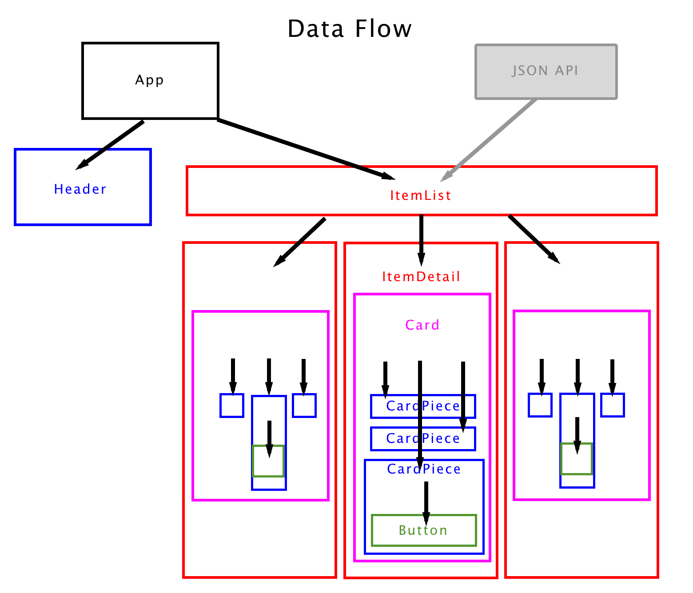

# React-Native Catalog :iphone::cd: 🎮

## [Adjectival](https://github.com/Adjectival)




## Function

Display catalog of cover art and game titles for unofficial video games.

Build basic react-native app composition skills.

## Installation

### :wrench: Config
Not available. Please google "react-native install" for hours of rewarding adventures.

### :construction: Development, once Your Tooling is Setup
+ Clone this repo.
+ ```cd RN-catalog/```
+ ```npm install```
+ ```react-native run-ios```
+ OR
+ ```react-native run-android```


## :triangular_flag_on_post: Development Goals

Refactor into reusable boilerplate for RN development.

## :card_index: Attribution

This code MIT freeware.

Based on [coursework from here](https://www.udemy.com/the-complete-react-native-and-redux-course).